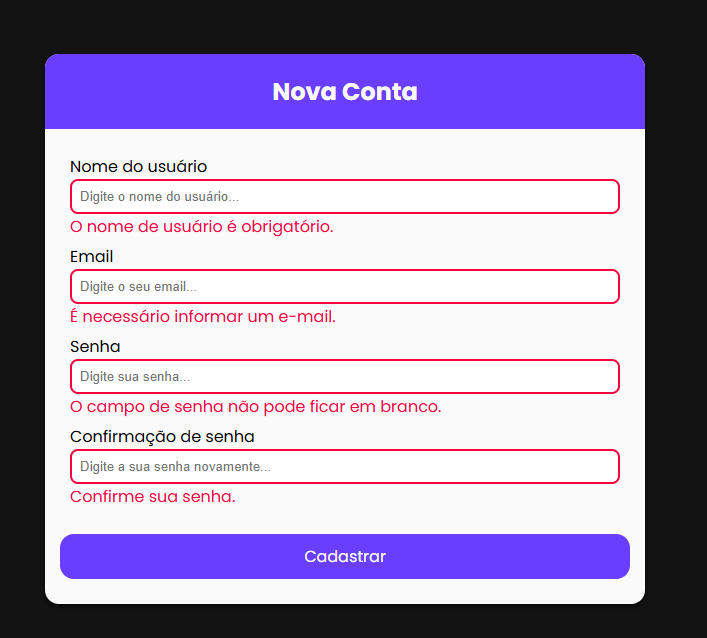
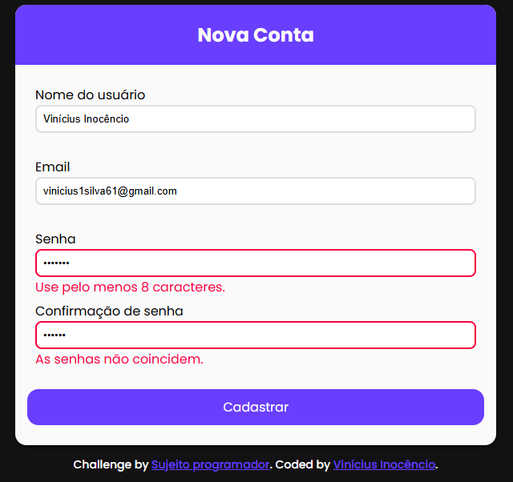

# 📝 Formulário com Validação em JavaScript

Formulário moderno com **validações dinâmicas em JavaScript puro**, focado no treinamento de manipulação do DOM.  
Os campos validados incluem: **nome de usuário**, **e-mail**, **senha** e **confirmação de senha**.

---

## 📌 Sobre o Projeto

Este projeto foi desenvolvido como exercício para reforçar os conhecimentos de:

- **Validação de formulários**
- **Eventos no DOM**
- **Feedback visual com classes dinâmicas**

Ao submeter o formulário, o JavaScript impede o envio e valida os campos individualmente, exibindo mensagens específicas embaixo de cada input.

---
## ⚙️ Funcionalidades

✔️ Validação de campos obrigatórios  
✔️ Verificação de tamanho mínimo da senha  
✔️ Confirmação de senha idêntica  
✔️ Exibição de mensagens de erro personalizadas  
✔️ Estilização automática de campos com erro  

---

## 🛠️ Tecnologias Utilizadas
- **HTML5**
- **CSS3**
- **JavaScript (Vanilla)**
---

## 🖥️ Resultado Visual

### 📱 Campos Vazios  

### 🔒 Senha com Menos de 8 Caracteres e Senhas diferentes

---
## 🌐 Acesse o Projeto

🔗 [**Clique aqui para visualizar no GitHub Pages**](https://inocenciooo.github.io/formulario-simples)

---

## 💬 Contribuições

Este projeto faz parte da minha jornada de aprendizado em **JavaScript e validação de formulários**.  
Fique à vontade para abrir uma issue, sugerir melhorias ou contribuir com o código! 🚀
